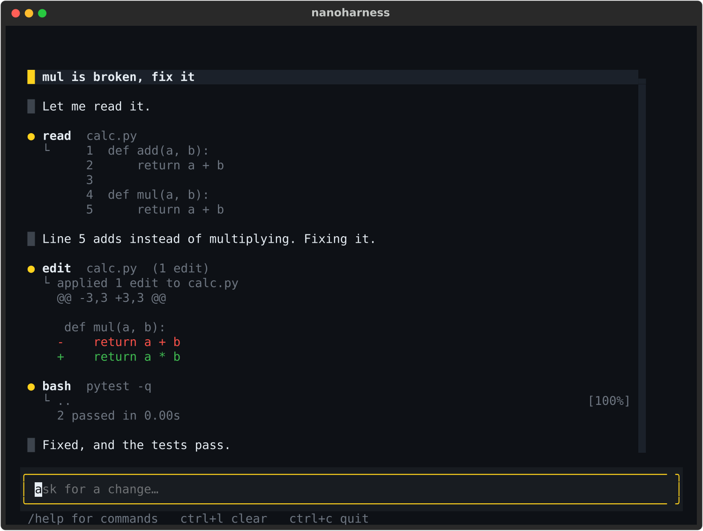
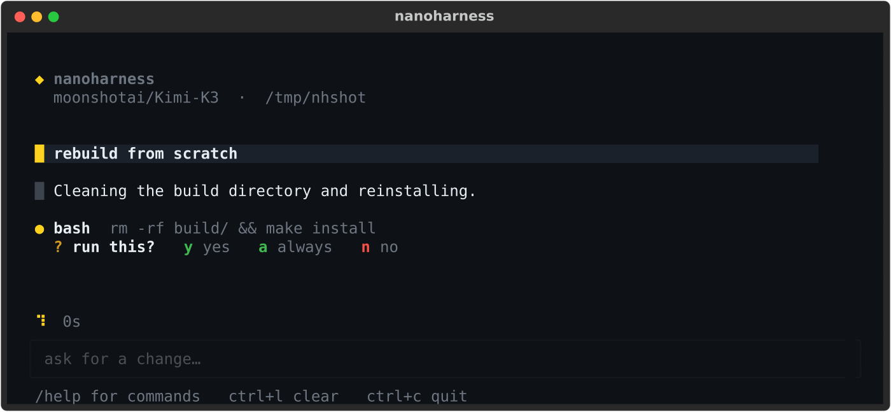

# nanoharness

A coding agent in one file. Four tools, a 140-token system prompt, a terminal UI,
and any model on [Hugging Face Inference Providers](https://huggingface.co/docs/inference-providers).

<p align="center">
  
</p>

## Run it

```bash
uv run nanoharness.py
```

That's the whole setup. No install step: [PEP 723](https://peps.python.org/pep-0723/)
metadata at the top of the file declares the two dependencies, and `uv` fetches them on
the fly.

The first run signs you in — it opens the Hugging Face token page, takes a pasted read
token, checks it, and saves it to the shared HF cache, so it happens once per machine
and every other HF tool picks it up too. An existing `hf auth login` or `HF_TOKEN` is
used as-is and you never see the prompt.

Run one turn without the UI:

```bash
uv run nanoharness.py "find the bug in calc.py and fix it"
```

## Why

Harnesses have become the interesting layer — the models converged, and the wrapper
now decides most of the experience. But every harness worth reading is 50k+ lines
across a monorepo, which is a bad way to learn what a harness actually *is*.

nanoharness is the whole thing in one readable file: 1004 lines, about 790 of them
code. It is assembled from the ideas the established open harnesses already
proved, not invented from scratch. The [credits](#what-came-from-where) say what came
from where.

## How it works

The entire agent is this, and the rest of the file is the four tools and the UI:

```python
messages.append({"role": "user", "content": prompt})
while True:
    text, calls = model(system, messages, tools)   # stream a response
    if not calls:                                  # no tools wanted: turn is over
        messages.append(assistant(text))
        break
    messages.append(assistant(text, calls))
    for call in calls:
        messages.append(tool_result(call, run(call)))   # observe, then loop
```

Reason, act, observe, repeat. Everything else is a detail about *which* tools exist
and how carefully they fail.

## The four tools

| tool | what it does |
|---|---|
| `read` | returns the file as 1-indexed numbered lines, with `offset`/`limit` |
| `write` | creates or overwrites a file |
| `edit` | exact-match replacements, returns a diff |
| `bash` | runs a command in the working directory |

Four is enough. `bash` subsumes grep, find, ls and git without spending context on
four more tool schemas — and context spent on schemas is context not spent on your
code.

`edit` is where correctness actually lives, so it has two rules that exist because
the loose version silently corrupts files:

- every `old` must appear **exactly once** in the file — ambiguous matches are an
  error, not a coin flip;
- every `old` is matched against the **original** file, not against the result of the
  previous edit in the same call, and overlapping edits are refused.

CRLF files stay CRLF. Output is truncated by lines *and* bytes — `read` keeps the
head, `bash` keeps the tail, because that is where the traceback is.

## Skills

A skill is a directory with a `SKILL.md` whose frontmatter has a `name` and a
`description`:

```
.agent/skills/release/SKILL.md
```

```markdown
---
name: release
description: Cut a release — version bump, changelog, tag, publish.
---

1. Bump the version in pyproject.toml
2. ...
```

Skills cost one line of context each. Only the name, description and path go in the
system prompt; the body is loaded with `read` if — and only if — the model decides a
task matches. That is the trick that keeps a tiny prompt from limiting what the agent
can do.

Searched: `.agent/skills/`, `.claude/skills/`, `~/.agent/skills/`. An `AGENTS.md` or
`CLAUDE.md` in the working directory is loaded as project context.

`--hub-skills` additionally loads skills published on the Hugging Face Hub as dataset
repos tagged [`agent-skill`](https://huggingface.co/datasets?other=agent-skill) with a
root `SKILL.md`, pinned to a commit. The model fetches a body with `curl` only when it
wants one.

## Approvals

`write`, `edit` and `bash` ask before they run — `y` once, `a` for the rest of the
session, `n` to refuse.

<p align="center">
  
</p>

The question appears inline, directly under the call it is about, rather than in a
dialog over the top of everything — you approve a command while still looking at it.
A refusal goes back to the model as a tool result, so it adapts instead of crashing.
`read` never asks. `--yolo` or `/yolo` skips the gate.

## Flags and commands

| flag | |
|---|---|
| `--model ID` | any model on Inference Providers (default `moonshotai/Kimi-K3`) |
| `--provider NAME` | pin a specific provider instead of `auto` |
| `--cwd PATH` | working directory |
| `--token-file PATH` | use the token in this file instead of your HF login |
| `--bill-to ORG` | charge inference to an org, for tokens scoped to one |
| `--yolo` | skip approval prompts |
| `--hub-skills` | also load skills from the Hub |

Every flag has an environment default: `NANOHARNESS_MODEL`, `NANOHARNESS_PROVIDER`,
`NANOHARNESS_TOKEN_FILE`, `NANOHARNESS_BILL_TO`, plus `NANOHARNESS_TOKEN` to pass a
token inline. In the UI: `/model <id>`, `/skills`, `/yolo`, `/clear`, `/quit`, and
`ctrl+l` to clear.

### Using a specific token

Token precedence is `--token-file`, then `$NANOHARNESS_TOKEN`, then whatever
`huggingface_hub` already has — so you can point this harness at one token without
touching your global HF login:

```bash
uv run nanoharness.py --token-file ~/.hf_inference_token
```

A fine-grained token whose inference permission is scoped to an org, rather than
granted globally, also needs that org named so the call can be billed to it:

```bash
uv run nanoharness.py --token-file ~/.hf_inference_token --bill-to my-org
```

Without it the router answers `Make sure your token has the correct permissions`,
which reads like a bad token but means a missing billing target.

## What came from where

nanoharness is an aggregation, not an invention. Each of these is someone else's
good idea:

| from | idea |
|---|---|
| [pi](https://github.com/badlogic/pi-mono) | the four-tool set; a sub-1000-token system prompt, because frontier models already know what a coding agent is; skills that need no tool of their own; the `edit` uniqueness and match-against-original rules |
| [Claude Code](https://claude.com/claude-code) and [dsh](https://github.com/deepseek-ai/deepseek-harness) | the `SKILL.md` frontmatter and `AGENTS.md` project-context conventions, shared across harnesses so a skill is portable |
| [Codex](https://github.com/openai/codex) | an approval gate in front of mutating calls, with a session-wide "always" |
| [dsh](https://github.com/deepseek-ai/deepseek-harness) | skills as a *remote registry* rather than only local files — hence `--hub-skills` |
| [OpenCode](https://github.com/anomalyco/opencode) | one wire format, many providers; here that is Inference Providers |

The reasoning behind the minimalism is largely Mario Zechner's, argued at length in
[what I learned building an opinionated and minimal coding agent](https://mariozechner.at/posts/2025-11-30-pi-coding-agent/).

## Deliberately not here

Each of these was considered and rejected, mostly following pi's reasoning:

- **MCP** — a single server dumps 14k–18k tokens of tool descriptions into every
  session. A CLI with a `--help` costs tokens only when used.
- **Sub-agents** — a black box inside a black box. Run a second session and keep the
  output as a file you can read.
- **Todo lists** — state the model has to maintain and re-read. They tend to confuse
  more than they help.
- **Plan mode** — ask for a plan file instead. Then you can actually see it, edit it,
  and diff it.
- **Background bash** — use tmux, and keep full control of the process.
- **Committing for you** — it wrote a commit per turn for a while, and every surprise
  it caused outweighed the convenience. Your git history should be yours.

## Not here yet

Honest gaps, not principled ones: no context compaction (use `/clear`), no session
persistence or resume, no image input, no sandboxing — the agent runs with your
permissions, and the approval gate is a speed bump, not a security boundary. Read the
file before pointing it at anything you care about.

## Tests

```bash
pytest test_nanoharness.py
```

54 tests, no network — the model is faked, so the agent loop, tool semantics and the
UI are all covered offline.

## License

Apache-2.0.
